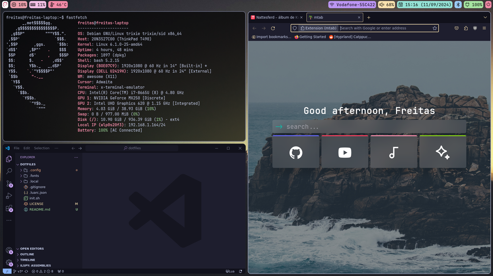

# dotfiles

My Linux configuration files :)

---

---

I'm rocking on:

- **WM**: AwesomeWM
- **Font**: Jetbrains Mono Nerd
- **Terminal**: Alacritty
- **Compositor**: Picom
- **Palette**: Catppuccin (Mocha)
- **Browser**: Firefox
- **Editor**: nano (term)/VSCode

My theme code was built barehands by me and using available snippets from other developers. Look 'n' feel was heavily inspired by this post on `/r/unixporn`: https://www.reddit.com/r/unixporn/comments/1f70ytx/hyprland_catppucin/